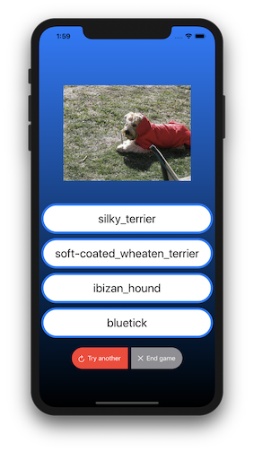
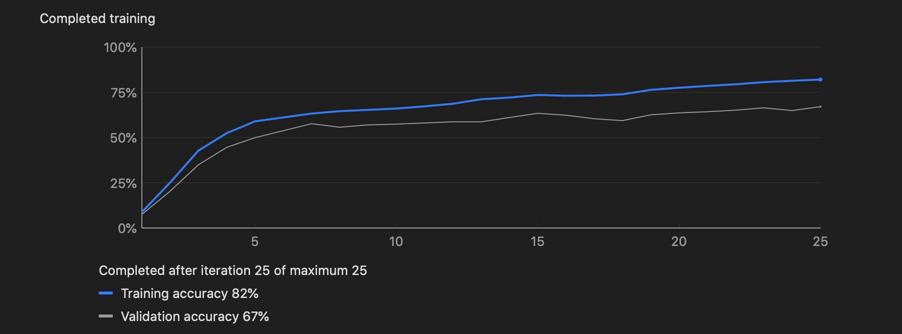

# Compete with AI !

## *Play a Dog Breed Identification Game against AI*

### Background

I am a believer in project based learning! This project is an opportunity for me to grasp basic ideas of `SwiftUI` (a new UI framework for iOS) and `CoreML` (a highly automated Machine Learning tool). Before starting this project, I have very little App development experience, so this is also a challenge for me. I am happy to find out how much I can do it.

### What is it

It is a game for a human player (YOU!) to compete with AI, specifically in the field of dog breed identification. When you start the game, a randomized dog image will show on the screen. You will be asked to make a decision among four possible choices - what is the breed of the dog. Your competitor - AI model - will also predict a breed based on the showing image. After each round you will be prompted to know the result of this round - if you/your competitor are correct or not. After you end the game, a final summary of your performance against AI will also be provided.

The player can play as many rounds as he/she wants. The player or AI will win one point if they have the right choice or prediction. There are four possible results in a single round:

- Both AI and the player are correct, then both will win one point
- AI is not correct, but the player is, then the player will win one point
- AI is correct, but the player is not, then AI will win one point
- Both AI and the player are wrong, then both will win zero point

### AI - Image Classification Model

The AI model is trained with `CoreML`. The dataset comes from [Kaggle](https://www.kaggle.com/c/dog-breed-identification/data). There are 120 dog breeds and it is very challenging for human to correctly figure them out (at least for myself)! The modeling process is pretty straight forward: 

* Data wrangling. The dataset downloaded from Kaggle can not be fed into `CoreML` directly, so I wrote a few lines (`data_preparation.ipynb`)  to manipulate the data to meet the corresponding requirements. Also randomly extract 5% data as test data. Make sure data is extracted evenly from different breeds. So in the end the training data contains 9768 images and testing data contains 454 images. These 454 images will also be used in your competition against AI.
* Training data. I am setting validation to be 20%, maximum iterations to be 25 and add rotation to augment data. 
* Testing. After training is finished, the model is applied to testing data to see how the model can generalize. 

The overall accuracy  scores are:

* Training - 82%
* Validation - 67%
* Testing - 56%

Training score is great but validation and testing score is much lower. That means there's room to improve the model's generalization. (That might be a good news because your competitor is not strong enough :P)

If we take a look at training activity, we can see the score doesn't improve much after 15th iteration. This probably means that I could save computing power to retain similar accuracy if reducing the number of iterations.

There are a few ways to increase the prediction ability. One way is to further augment data by add noice, crop, or flip to make model generalize better, but this requires much more computation power.

### Project Progress

The project is still in progress - I will continuously improve it. The two things I will mostly focus on are:

* Design better user interaction
* Train stronger AI model